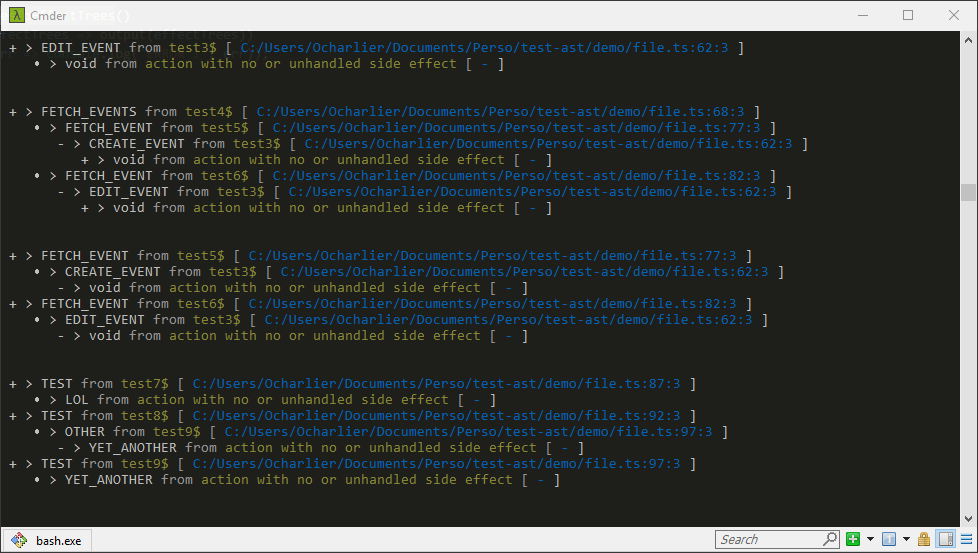
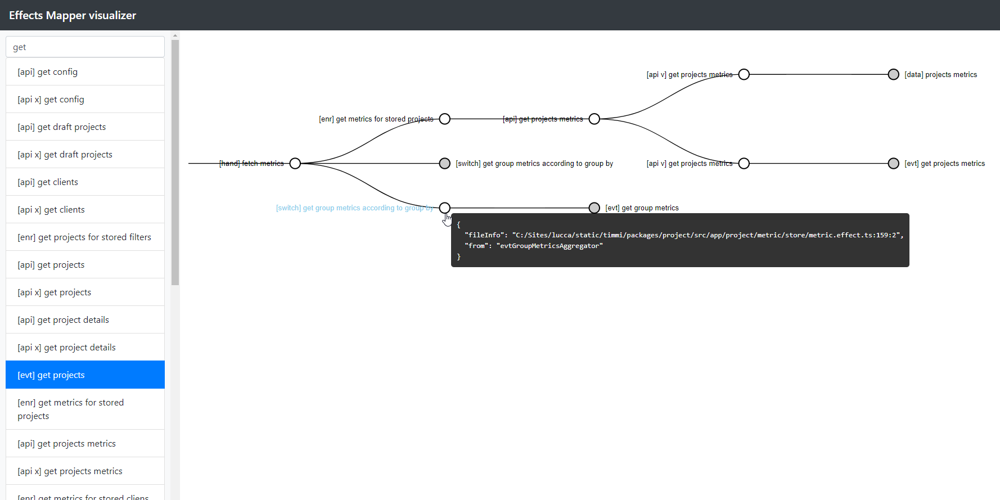

# Effects Mapper

Using `@ngrx/effects` ? Ever had trouble following the flow of effects in your
app ? Easily generate a map of whats action causes what.

## 📦 Installation & Usage

To install this application, you'll need
[Node.js](https://nodejs.org/en/download/) 8+ (which comes with
[npm](http://npmjs.com)) installed on your computer. You'll also need [Git](https://git-scm.com) to run the project from source:

```bash
# Clone this repository
$ git clone https://github.com/Riron/effects-mapper

# Go into the repository
$ cd effects-mapper

# Install dependencies
$ npm install

# Run the app on an entire folder
$ npm run console ./demo
# Or on individual files
$ npm run console ./file1.ts ./file2.ts
```

You can print the result either to the console or to a JSON file. With the JSON file, you can then use the browser UI (see below) and visualize you effects as trees.

```bash
# Use the console output
$ npm run console ./demo

# Use the JSON output (for browser UI)
$ npm run json ./demo
```



## 🔮 Browser UI

If you chose to generate a JSON file, you can then visualize the result in the browser.

```bash
# Move the created "tree-xxxxx.json" file to the "./client" directory and rename it as "trees.json"
$ mv tree-xxxxx.json ./client/trees.json

# Open the browser UI
$ npm run browser
```



## 🔬 How does it work ?

This tool statically analyze your code. It uses the Typescript compiler
to grab all properties decorated with the `@Effect()` decorator and then perform its magic on the `ofType()` call for the input, and the returning call for the output.

## 💣 Edges cases

Some edge cases are not fully supported yet. If the library is not able to
determine the return type of an effect, it will consider the return type is
null.

Example of unhandled cases:

```typescript
// If the type
@Effect() effect = this.ofType('A_TYPE')
	.map(action => { type: action.type })

// if you reference imports that are not part of the analysis, it won't be possible to guess the action type
import { AnAction } from 'unloadedNpmModule'
@Effect() effect = this.ofType('A_TYPE')
	.map(_ => AnAction)
```

And probably others... As people use the library, more and more cases
will be implemented. Feel free to create an issue if one of your effects is not
handled properly !
